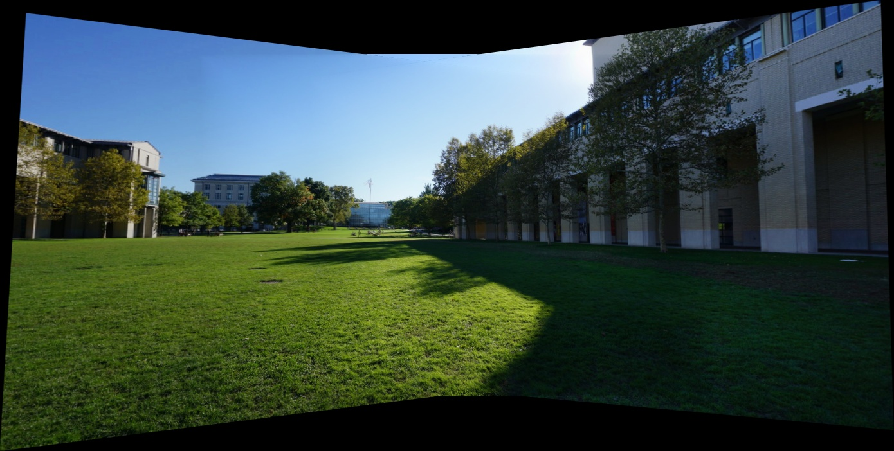
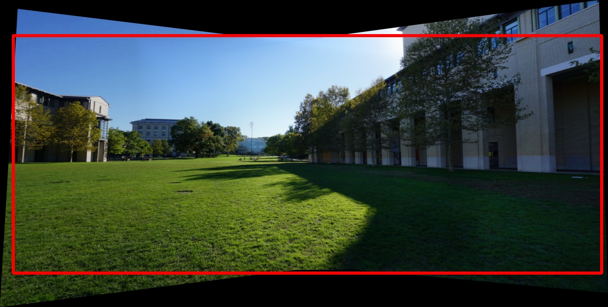
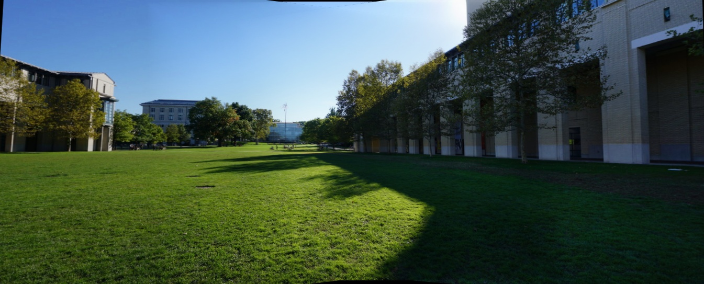
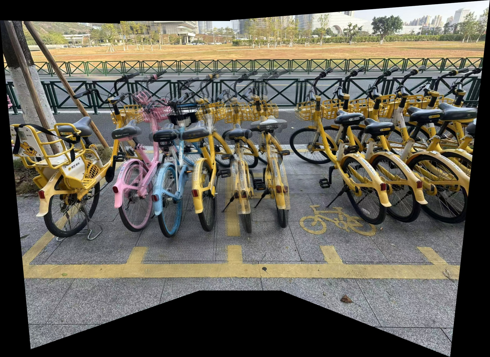
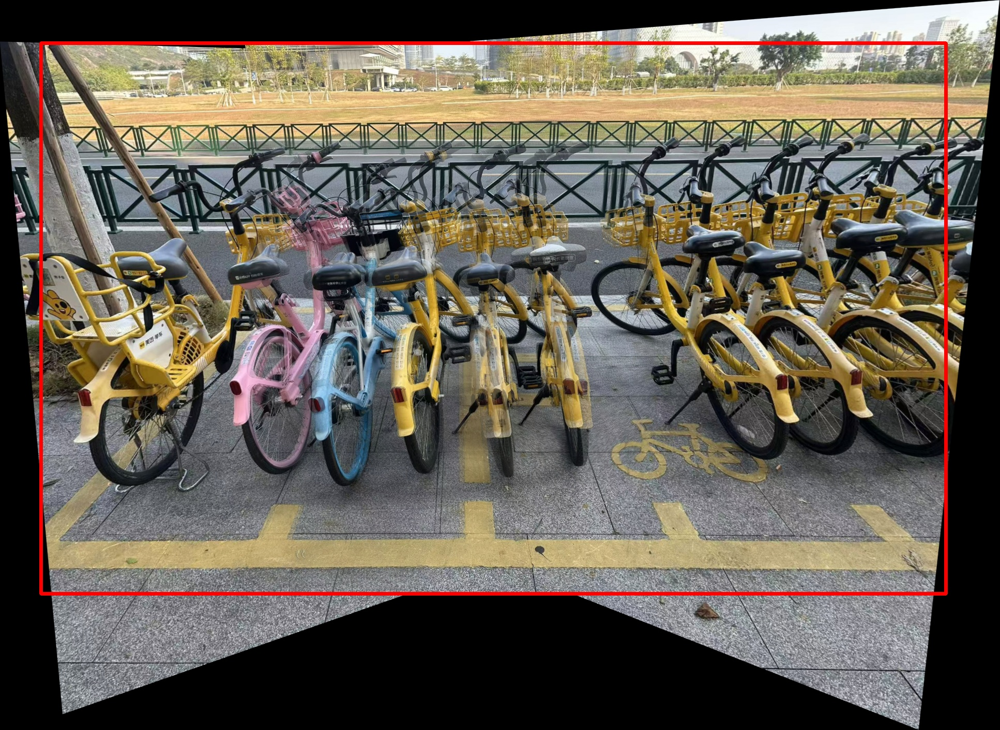
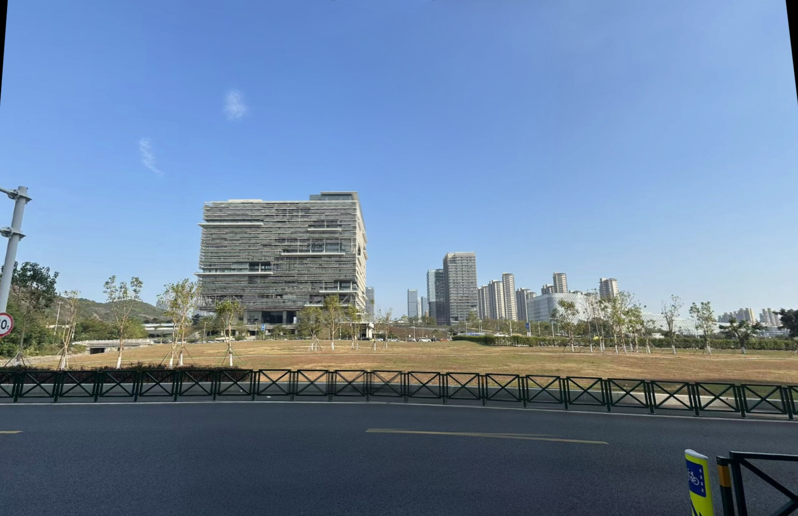
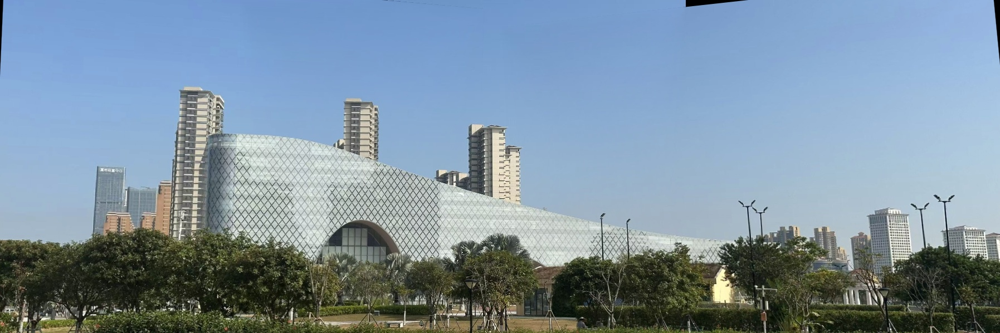
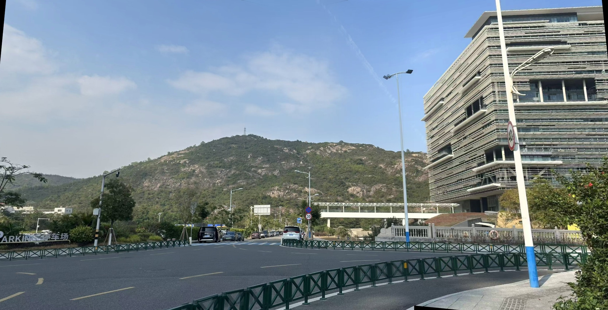

# Panorama Stitching with Advanced Blending 🖼️

## Project Overview
This project is a computer vision application developed for the **Final Project of Computer Vision**. 

It implements a robust image stitching pipeline capable of combining three overlapping images (Left, Middle, Right) into a single, seamless high-resolution panorama. The system is designed to handle hand-held shooting conditions, featuring **auto-exposure compensation** and **distance-weighted blending** to eliminate visible seams and lighting inconsistencies.

## ✨ Key Features

* **Multi-Image Stitching:** Seamlessly stitches 3 images based on a center-reference geometry.
* **Robust Feature Matching:** Utilizes **SIFT** (Scale-Invariant Feature Transform) with **RANSAC** for accurate homography estimation.
* **Exposure Compensation:** Automatically analyzes and adjusts brightness differences (Gain analysis in HSV space) between images to fix "day-and-night" inconsistencies.
* **Advanced Blending:** Implements **Distance-based Weighted Blending** (using Euclidean Distance Transform) to ensure smooth transitions and suppress ghosting caused by parallax.
* **Smart Auto-Cropping:** Implements an **Adaptive Cropping Algorithm**. It attempts an aggressive rectangular crop first, but includes a **Smart Fallback Mechanism** to automatically switch to a safe bounding box if significant image distortion is detected (preserving content over shape).

## 🛠️ Tech Stack

* **Language:** Python 3.9+
* **Libraries:**
    * `opencv-python` (Computer Vision algorithms)
    * `numpy` (Matrix operations)

## 🚀 Installation & Usage

1.  **Clone the repository:**
    ```bash
    git clone [https://github.com/terizx/cv_final.git](https://github.com/terizx/cv_final.git)
    cd cv_final
    ```

2.  **Install dependencies:**
    ```bash
    pip install numpy opencv-python
    ```

3.  **Prepare your images:**
    Place your image sets in the `images/` folder (e.g., `images/set1/`, `images/baseline/`). Each folder must contain:
    * `left.jpg`
    * `mid.jpg`
    * `right.jpg`

4.  **Run the script:**
    ```bash
    python stitch_3_imgs.py
    ```

5.  **Check the result:**
    The results will be saved in the `result_images/` directory, including intermediate visualization steps.

## 📊 Methodology

The pipeline consists of 5 main stages:

1.  **Pre-processing:** Computes the brightness gain between overlapping images and applies exposure compensation.
2.  **Feature Matching:** Extracts SIFT keypoints and matches them using KNN (k=2) with Lowe's Ratio Test.
3.  **Homography:** Calculates the transformation matrix using RANSAC to align the Left and Right images to the Middle plane.
4.  **Warping & Blending:** Warps images to a common coordinate system and blends them using a **Distance Weight Map**, where pixels closer to the center have higher opacity.
5.  **Post-processing:** Uses a smart algorithm to crop the valid area. It visualizes the crop box before generating the final output.

## 🖼️ Results & Post-processing Pipeline

To ensure the best visual quality, we implemented a multi-stage post-processing pipeline. The system visualizes the optimal cropping area (Red Box) before generating the final output.

### Case 1: Ideal Scenario (Aggressive Rectangular Crop)
*Dataset: Baseline (Official Benchmark)*
> The algorithm successfully detects a valid rectangular region and removes all black borders.

| Stage 1: Raw Stitching | Stage 2: Crop Detection | Stage 3: Final Panorama |
| :---: | :---: | :---: |
|  |  |  |

### Case 2: High Distortion Scenario (Smart Fallback Mode)
*Dataset: Set 2 (Hand-held Bicycles)*
> Due to strong parallax and perspective distortion, aggressive cropping would lose >40% of the content. The **Smart Fallback** mechanism automatically triggers to preserve the image content (Safe Mode).

| Stage 1: Raw Stitching | Stage 2: Crop Detection (Fallback) | Stage 3: Final Panorama |
| :---: | :---: | :---: |
|  |  |  |

### 🌍 Gallery: Diversity Analysis
We evaluated the algorithm on various scene types to demonstrate its robustness across different geometric structures and lighting conditions.

| Scene Type | Final Panorama |
| :--- | :--- |
| **Set 1: Modern Office Complex**<br>(Challenges: Straight lines & Geometric perspective) |  |
| **Set 3: Museum Architecture**<br>(Challenges: Curved surfaces & Repetitive patterns) |  |
| **Set 4: Mountain Landscape**<br>(Challenges: Natural features, Trees & Long distance) |  |

## 👥 Team Members

* **QIUZIXI**: Algorithm implementation, Exposure Compensation, Blending logic.
* **YANGZHIYI**: Feature Matching pipeline, Testing, Project documentation.

## 📄 License

This project is licensed under the MIT License - see the [LICENSE](LICENSE) file for details.